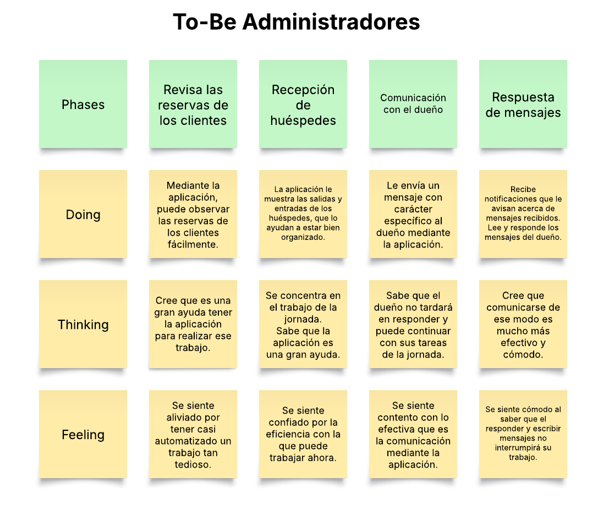

# 
Informe del Trabajo Final

    <strong>Universidad Peruana de Ciencias Aplicadas</strong> 
    </img> 
    <strong>Ingeniería de Software</strong> 
    <strong>Desarrollo de Soluciones IoT - 2971</strong> 
    <strong>Profesor: Angel Augusto Velasquez Nuñez </strong> 
     INFORME

#### Startup: **Sweet Manager**

#### Product: **Sweet Manager**

## Team  Members:

|               Member                |    Code    |
| :---------------------------------: | :--------: |
| Mauricio Abraham Rivo Rojas Sánchez | U202211572 |
| Giacomo Zoppi Rodriguez | U202210029 |
| Omar Andrew Morales Montalvo | U202212383 |
| Ramón Alejandro Jorge Arévalo | U20221D126 |
| Integrante 5 | U202211168 |
| Integrante 6 | U202211168 |

# Registro de Versiones del Informe

<table>
    <thead>
    <tr>
        <th>Version</th>
        <th>Fecha</th>
        <th>Participantes</th>
        <th>Observaciones</th>
    </tr>
    </thead>
    <tbody>
    <tr>
        <td>TB1</td>
        <td>29/03/2024</td>
        <td>Mauricio Abraham Rivo Rojas Sánchez</td>
        <td>
        <ul>
        <li> Software Configuration Management </li>
        <li> Landing Page, Services & Applications Implementation  </li>
        </ul>
        </td>
    </tr>
    <tr>
        <td>TB1</td>
        <td>29/03/2024</td>
        <td>Giacomo Zoppi Rodriguez</td>
        <td>
        <ul>
        <li> Competidores</li>
        <li> Entrevistas</li>
        <li> Needfinding </li>
        <li> Ubiquitous Language</li>
        </ul>
        </td>
    </tr>
    <tr>  
    </tr>
    <tr>
        <td>TB1</td>
        <td>29/03/2024</td>
        <td>Integrante 3</td>
        <td>
        <ul>
        <li> StartUp Profile</li>
        <li> Solution Profile </li>
        <li> Segmento Objetivo </li>
        </ul>
        </td>
    </tr>
    <tr>
        <td rowspan="1">TB1</td>
        <td rowspan="1">29/03/2024</td>
        <td>Integrante 4</td>
        <td>
        <ul>
        <li> Style Guidelines</li>
        <li> Information Architecture </li>
        <li> Landing Page UI Design </li>
        <li> Web Applications UX/UI Design </li>
        <li> Web Application Prototyping</li>
        </ul>
        </td>
    </tr>
    <tr>
        <td rowspan="1">TB1</td>
        <td rowspan="1">29/03/2024</td>
        <td>Integrante 5</td>
        <td>
        <ul>
        <li> To-be Scenario Mapping </li>
        <li> User Stories </li>
        <li> Impact Mapping </li>
        <li> Product Backlog</li>
        </ul>
        </td>
    </tr>
    <tr>
        <td rowspan="1">TB1</td>
        <td rowspan="1">29/03/2024</td>
        <td>Integrante 6</td>
        <td>
        <ul>
        <li> To-be Scenario Mapping </li>
        <li> User Stories </li>
        <li> Impact Mapping </li>
        <li> Product Backlog</li>
        </ul>
        </td>
    </tr>
    </tbody>
</table>

---

# Capítulo I: Introducción

## 1.1. Startup Profile

### 1.1.1. Descripción de la Startup
El proyecto escogido es Sweet Manager, una solución tecnológica enfocada en la gestión eficiente de hoteles, diseñada para facilitar el trabajo administrativo y operativo, así como, modernizar los procesos administrativos.

Nuestro objetivo es brindar a los hoteles una plataforma integral que centralice la administración de reservas y habitaciones, incorporando además tecnologías IoT para mejorar el confort, la seguridad y la eficiencia energética de los espacios.

Para la monetización, utilizamos un modelo de negocio basado en suscripción escalable, el cual se adapta al tamaño y necesidades de cada hotel, e incorpora la gestión de dispositivos IoT como valor agregado. Es decir, cada nivel de suscripción incluye funcionalidades básicas del sistema (gestión de reservas, finanzas, etc.), además de una cantidad determinada de dispositivos IoT preconfigurados para su uso inmediato. Para el aprovisionamiento de hardware, pensamos usar un modelo de Partner Reseller: el partner instala y mantiene el hardware, y Sweet Manager comparte ingresos por suscripción.

VISION: 

MISION: 

### 1.1.2. Perfiles de integrantes del equipo

| Miembros del equipo                             | Codigo Estudiante | Carrera                | Conocimientos / Habilidades |
| ----------------------------------------------- | ----------------- | ---------------------- | --------------------------- |
| Mauricio Abraham Rivo Rojas Sánchez	 | U202211572            | Ingenieria de software | C++, C#, javascript y java            |

## 1.2. Solution Profile

### 1.2.1. Antecedentes y problemática

Siguiendo la estructura propuesta

-   **What?**

-   **When?**
    ¿Cuando estamos viendo el problema?

    ¿En que momento del día y/o del proceso en cuestión?

-   **Where?**
    ¿Donde estamos viendo los problemas?¿En que parte/lugar del producto/proceso estamos viendo el problema?

-   **Who?**
    ¿A quien le sucede? ¿El problema está relacionado con las habilitades de las personas?

-  **Why?**
  ¿Por qué sucede el problema? ¿Cual es la causa?

-   **How?**
    ¿Como se diferencia el problema del estado normal(optimo)? ¿La tendencia en la que aparece el problema es aleatoria o sigue un patrón?

    ¿Como se utilizará el producto?

-   **How much?**
    ¿Cuantos problemas se dan en un dia? ¿En una semana? ¿En un mes?

    ¿Cuanto dinero están implicando?

### 1.2.2. Lean UX Process
---
#### 1.2.2.1. Lean UX Problem Statements
---
**Problem Statement:**

Siguiendo la estructura propuesta por Jeff Gothelf y Josh Seiden, en su libro "Lean Ux 3rd Edition":

**El estado actual de** la gestión hotelera en hoteles pequeños y medianos se ha centrado principalmente en procesos manuales, soluciones de software fragmentadas y una adopción limitada de tecnologías innovadoras. La mayoría de los sistemas existentes solo abordan funciones básicas como las reservas y la facturación, sin ofrecer una integración integral e inteligente en toda la operación del hotel.

**Los productos y servicios actuales no abordan adecuadamente** la necesidad de integrar tecnologías IoT que mejoren el confort y la experiencia de los huéspedes, ni brindan una plataforma administrativa centralizada, fácil de usar y escalable según el tamaño y las necesidades del hotel.

Sweet Manager **busca cerrar esta brecha mediante** el desarrollo de una solución tecnológica, que integre dispositivos IoT para el control inteligente de habitaciones, al mismo tiempo que simplifica la gestión administrativa y agiliza los procesos de reseva de habitaciones a los huéspedes. 

**Nuestro enfoque inicial estará dirigido** a hoteles pequeños y medianos ubicados en zonas urbanas de América Latina, que buscan modernizar sus operaciones y reducir costos a través de la transformación digital, así como, futuros huespedes interesados en hacer una reserva personalizada rapidamente. 

**Sabremos que hemos tenido éxito cuando observemos** una mayor tasa de adopción de la plataforma, una reducción comprobada de los costos operativos en los hoteles clientes y un aumento en los índices de satisfacción de los huéspedes.

**Dominio:**

La solución se encuentra en el dominio de la gestión hotelera inteligente, donde convergen operaciones administrativas, experiencia del huésped y tecnologías emergentes como el Internet de las Cosas (IoT). Apunta a digitalizar y optimizar la operación diaria de hoteles, combinando eficiencia operativa, automatización y personalización de servicios.

**Segmentos de Clientes:**

Nos dirigimos a los propietarios y administradores de hoteles de tamaños pequeño y mediano, así como a clientes interesados en una agil gestión de reservas. 

**Puntos de Dolor:**

Administradores: uso excesivo de hojas de cálculo, falta de visibilidad en tiempo real, herramientas desconectadas y procesos manuales que consumen tiempo.

Dueños: dificultad para monitorear operaciones desde fuera del hotel, falta de indicadores claros sobre rentabilidad y ocupación.

Huéspedes: procesos de reserva tediosos, comunicación poco eficiente, escasa personalización del servicio.

**Visión/Estrategia:**

Nuestra visión es proporcionar una solución integral y fácil de usar que aborde todas las necesidades de gestión de un hotel, así como mejorar la experiencia del cliente al ofrecer una plataforma dinamica y sencilla para poder gestionar y realizar sus reservas. 

**Segmento Inicial:**

Nos enfocamos inicialmente en hoteles independientes y pequeñas cadenas hoteleras que buscan soluciones accesibles y eficientes para optimizar sus operaciones. Este segmento ofrece la oportunidad de validar rápidamente el producto en contextos reales, generar casos de éxito locales y escalar hacia otras regiones.

---

#### 1.2.2.2. Lean UX Assumptions
---
#### Features
---
**Para el administrador del hotel:**

- Gestión de habitaciones, incluyendo un control de ocupación en tiempo real.

- Visualización de  reservas hechas por huéspedes. También puede registrar manualmente la llegada (check-in) y salida (check-out),

- Integración con dispositivos IoT, que permitan automaticamente adecuarse a las necesidades de sus Huéspedes. 
  
- Comunicación directa por correo dentro del sistema entre personal del hotel

- Gestión de proveedores y suministros necesarios dentro de la aplicación. 

**Para el Huésped del hotel (huésped):**

- Interfaz intuitiva para que el huésped pueda seleccionar fechas, tipo de habitación, servicios adicionales

- Personalización de la habitación, pudiendo determinar valores como la temperatura de la misma. 

- El usuario puede consultar sus estadías anteriores.

**Para el dueño del hotel (owner):**

- Posibilidad de monitorear los indicadores clave del hotel en tiempo real.

- Indicadores clave de rentabilidad y ocupación.

- En caso de que el dueño tenga más de un hotel, podrá ver datos agrupados y comparativos entre ellos.

- El propietario puede gestionar los servicios contratados con Sweet Manager, actualizar su plan, etc. 

---
#### Business Outcomes
---
 ¿Cómo sabremos que resolvimos el problema de negocio? ¿Qué mediremos?

Los siguientes indicadores nos permitirán evaluar si la solución propuesta está generando el impacto esperado en el negocio hotelero:

- **Reducción de costos operativos**: Esperamos que al implementar Sweet Manager, se reduzca al menos un 20% en los primeros 6 meses, gracias a una gestión más efectiva de ingresos y recursos que optimiza los costos operativos y maximiza los ingresos.
- **Incremento en la eficiencia del personal administrativo**: 30% de reducción de tiempo en el tiempo dedicado a tareas administrativas como la gestión de reservas o de habitaciones, lo que se traducirá en una mejora tangible en la eficiencia operativa del hotel.
- **Retención de los Huéspedes**: Mediante el uso de Sweet Manager, esperamos un aumento del 20% en el número de Huéspedes que realizan reservas repetidas dentro de un año, lo que indica una mayor fidelización gracias a una gestión más efectiva y una experiencia de calidad para los huéspedes.
- **Aumento en la adopción del sistema**: Con Sweet Manager, esperamos un 60% de uso diario del sistema en los primeros 3 meses, con tanto los administradores como los Huéspedes estando al tanto de sus reservas y de datos importantes en la aplicación. 
- **Mayor Satisfacción del Huésped**: Gracias a Sweet Manager, esperamos ver un aumento de 0.5 puntos en la calificación promedio de satisfacción del Huésped en las reseñas en línea (fuera de Sweet Manager, refiriendose a servicios externos como las calificaciones de Google Maps, etc) , lo que reflejaría la mejora en la experiencia del Huésped, gracias a una gestión más eficiente y una atención más personalizada.

---
#### Users
---
> **Referencia metodológica:**  
> Según *Lean UX, 3rd edition*, se recomienda crear proto-personas basadas en suposiciones iniciales del equipo, las cuales deben validarse y actualizarse continuamente mediante investigación y observación directa.

Administradores: Los administradores son responsables de garantizar el correcto funcionamiento del hotel en el día a día. Entre sus principales responsabilidades se encuentran la gestión de reservas, control financiero, coordinación del personal, supervisión del inventario y análisis de indicadores clave

Huéspedes: Los Huéspedes representan a los usuarios externos que buscan alojamiento por motivos turísticos, laborales o personales. Este perfil incluye tanto a familias como a viajeros individuales o de negocios.

Dueños: Los dueños de hotel representan a los creadores de la organización y jefes de los administradores. Se encargan de monitorear la correcta gestión del hotel asi como del rendimiento financiero y operativo del mismo. 

##### Proto-persona 1 – Carla, Administradora de Hotel

- **Behavioral demographic information**  
  Administradora de un hotel. Mujer de jornada completa (9:00 a.m. - 5:00 p.m.) encargada de la gestión operativa y financiera del establecimiento. Coordina con un equipo administrativo para mantener el funcionamiento del hotel.

- **Pain points and needs**  
    - **Metas**  
      - Optimizar el tiempo invertido en tareas administrativas.  
      - Aumentar la ocupación del hotel mediante una mejor gestión.  

    - **Necesidades**  
      - Automatizar tareas repetitivas y procesos manuales.  
      - Acceder fácilmente a datos e indicadores clave para la toma de decisiones.  

    - **Frustraciones**  
      - Uso excesivo de hojas de cálculo.  
      - Pérdida de tiempo con proveedores de tecnología poco claros o soluciones poco intuitivas.
        
- **Potential Solutions**
    - Una herramienta que permita gestionar mejor los procesos administrativos y operativos a su cargo.
  
---

##### Proto-persona 2 – José, Huésped del Hotel

- **Behavioral demographic information**  
  Hombre casado que viaja temporalmente con su familia por motivos turísticos. Representa al Huésped típico que busca hospedaje cómodo y sin complicaciones para disfrutar de su viaje familiar.

- **Pain points and needs**  
    - **Metas**   
      - Disfrutar tiempo de calidad con su familia.  
      - Garantizar bienestar y educación a sus hijos.  
      - Aprovechar sus vacaciones sin estrés ni contratiempos.  

    - **Necesidades**  
      - Reservar habitaciones de forma sencilla y rápida.  
      - Contar con servicios que le permitan relajarse y enfocarse en su familia.  

    - **Frustraciones**  
      - Exceso de trámites y procesos al elegir y reservar alojamiento, lo que vuelve mas tediosas sus vacaciones.
     
  - **Potential Solutions**
          - Una herramienta que permita agilizar los tramites y procesos tediosos al reserver alojamiento
---

##### Proto-persona 3 – Lucía, Dueña del Hotel

- **Behavioral demographic information**
- Dueña de dos hoteles en Lima. Supervisa KPIs y busca inversiones rentables. Tiene conocimientos financieros y experiencia en administración.

- **Pain points and needs**

    - **Metas:**
        -  Rentabilizar la operación y asegurar crecimiento sostenible.

    - **Necesidades:**
        - Gestionar un correcto funcionamiento del hotel, asi como su generación de ingresos. 

    - **Frustraciones:**
        - Falta de visibilidad consolidada y herramientas de análisis.

- **Potential Solutions**
    - Dashboard financiero con indicadores de ROI y performance general.
---
##### User Outcomes & Benefits
---
> **Referencia metodológica:**  
> Según *Lean UX, 3rd edition*, usando los proto personas como base , podemos hacernos esta serie de preguntas: What is the user trying to accomplish?, How does the user want to feel during and after this process?, How does our product or service get the user closer to a life goal or dream?, Why would your user seek out your product? y What behavior change can we observe that tells they’ve achieved their goal?

###### Carla, Administradora de Hotel
- **¿Qué quiere lograr?** Mayor control y organización sobre los procesos operativos con el panel de control centralizado. 
- **¿Cómo quiere sentirse?** Tranquila, organizada y en control.
- **¿Cómo la ayuda Sweet Manager?** Centraliza información, automatiza flujos y muestra reportes en tiempo real.
- **¿Por qué lo buscaría?** Necesita herramientas modernas que reemplacen las hojas de cálculo.
- **¿Qué cambio observaríamos?** Disminuye el uso de Excel y usa el panel de control de Sweet Manager a diario.

###### José, Huésped del Hotel
- **¿Qué quiere lograr?** Alcanzar una experiencia de reserva sencilla, rapida y personalizada. 
- **¿Cómo quiere sentirse?** Relajado y satisfecho. 
- **¿Cómo la ayuda Sweet Manager?** Visualiza habitaciones de hotel, hace la reserva y las personaliza. 
- **¿Por qué lo buscaría?** Quiere reservar habitaciones de forma sencilla y agil. 
- **¿Qué cambio observaríamos?** Usaria Sweet Manager para personalizar y escoger la mejor experiencia hotelera.

###### Lucía, CEO del Hotel

- **¿Qué quiere lograr?** Mayor control y organización sobre el rendimiento financiero y operativo de un hotel.  
- **¿Cómo quiere sentirse?** Segura de sus decisiones de inversión.
- **¿Cómo la ayuda Sweet Manager?** Le entrega insights estratégicos y le permite controlar la gestión hotelera. 
- **¿Por qué lo buscaría?** Para supervisar operaciones sin depender de terceros.
- **¿Qué cambio observaríamos?** Toma de decisiones mas rapidas y una mejor gestión. 
---
#### User Assumptions
---
1. ¿Quién es el usuario?

Administrador: Responsable de la operación y administración del hotel.

Huésped: Persona que desea hospedarse con comodidad y sin complicaciones en un hotel.

Dueño: Supervisa la rentabilidad del hotel.

2. ¿Dónde entra nuestro producto en su trabajo o vida?
   
Administrador: En su rutina diaria laboral. Le permitirá agilizar procesos.

Huésped: En la planificación y reserva de su estadía.

Dueño: Al revisar resultados del negocio.

3. ¿Cuál es el problema que nuestro producto soluciona?
   
Administrador: Procesos manuales, desorden y problemas de organización. 

Huésped: Reservas complejas y procesos tediosos.

Dueño: Falta de visibilidad financiera.

4. ¿Cómo y cuándo nuestro producto es usado?
Administrador: A diario, desde el trabajo, para gestionar el hotel.

Huésped: Antes y durante su viaje, para reservar y consultar servicios.

Dueño: Semanalmente o en momentos clave.

5. ¿Qué características son importantes?
Administrador: Automatización, una buena administración y una interfaz intuitiva.

Huésped: Reservas rápidas, interfaz clara, confirmaciones inmediatas.

Dueño: Indicadores estratégicos. 

6. ¿Cómo debería nuestro producto verse o comportarse?
    
Administrador: Profesional, organizado y confiable.

Huésped: Simple, amigable y rápido.

Dueño: Profesional, confiable y accesible.

---
#### Business Assumptions
---
> *Extraído y adaptado del modelo propuesto en **Lean UX Sampler** de Jeff Gothelf*

1. **Creo que mis Huéspedes tienen la necesidad de:**  
   Administrador: Mejorar la eficiencia operativa de sus hoteles mediante automatización y control energético.
   Huésped: Tener una experiencia mas satisfactoria y sencilla a la hora de hacer y gestionar sus reservas de habitaciones en un hotel. 

2. **Estas necesidades pueden resolverse con:**  
   Administrador: Una plataforma integral que centralice gestión de reservas, finanzas y dispositivos IoT.
   Huéspedes: Una plataforma digital de gestión de reservas, con opciones de personalización.
   Dueño: Una plataforma que le permita visualizar la gestión de reservas y habitaciones de su hotel. 

4. **Mis Huéspedes iniciales son (o serán):**  
   Hoteles pequeños y medianos en Lima y sus Huéspedes.

5. **El valor principal que un Huésped desea obtener de mi servicio es:**  
   Administracion y Dueños: Reducción del tiempo y costo operativos y administrativos.
   Huésped: Reducción del tiempo y de cantida de tramites para efectuar una reserva en un hotel. Así como, una mejor experiencia en su reserva. 

6. **Adquiriré a la mayoría de mis Huéspedes a través de:**  
   Administradores y Dueños: Partners tecnológicos, asociaciones hoteleras y marketing digital.
   Huéspedes: Marketing digital. 

7. **Ganaré dinero mediante:**  
   Un modelo de suscripción escalable con funcionalidades básicas e IoT incluidos.

8. **Mi competencia principal en el mercado será:**  
   Sistemas tradicionales de gestión hotelera, gestión empresarial o CRMs
   **Nos diferenciaremos por:**  
   - Innovación tecnológica  
   - Interfaz amigable  
   - Soporte mediante partners

9. **Mi mayor riesgo de producto es:**  
   Poca adopción de funcionalidades IoT por desconocimiento, 
   **Lo resolveremos mediante:**  
   Capacitación, asistentes y soporte técnico.

10. **Que otros supuestos tenemos, que si probados falsos, pueden causar que nuestro proyecto falle**  
   - Que los hoteles pequeños estén dispuestos a pagar por tecnología.
   - Que los administradores esten dispuestos a acelarar sus procesos con nuestro software y no otras herramientas como la IA.   
   - Que la instalación IoT sea rentable y escalable.  
   - Que los partners brinden soporte técnico confiable.

---

#### 1.2.2.3. Lean UX Hypothesis Statements.

---

Usando la información recolectada en los Business Outcomes, Usuarios, Beneficios y Features. Podemos formular nuestras hipótesis, cada una centrada en un Feature a desarrollar.

Hipótesis 1:

Creemos que se logrará una reducción del 30% en el tiempo dedicado a tareas administrativas
si los administradores del hotel
alcanzan mayor control y organización sobre los procesos operativos
con el panel de control centralizado.

Hipótesis 2:

Creemos que se logrará un aumento del 20% en la cantidad de huéspedes que realizan reservas repetidas en un año
si los huéspedes del hotel
alcanzan una experiencia de reserva personalizada y sin complicaciones
con la funcionalidad de personalización de habitación en línea.

Hipótesis 3:

Creemos que se logrará una reducción del 20% en los costos operativos en los primeros 6 meses
si los dueños del hotel
alcanzan una mayor visibilidad sobre el rendimiento financiero y operativo
con el acceso móvil a reportes financieros y operativos.

Hipótesis 4:

Creemos que se logrará un 60% de uso diario del sistema durante los primeros 3 meses
si los administradores del hotel
alcanzan una comunicación y gestión más rápida
con la función de mensajería integrada en la aplicación.

Hipótesis 5:

Creemos que se logrará un aumento de 0.5 puntos en la calificación promedio de satisfacción del huésped en reseñas en línea
si los huéspedes del hotel
alcanzan una estadía más cómoda y adaptada a sus preferencias
con las opciones de personalización de la habitación, como la temperatura.

---

#### 1.2.2.4. Lean UX Canvas

---

## 1.3. Segmentos objetivo

Incluir Stakeholders internos y externos. 

# Capítulo II: Requirements Elicitation & Analysis

## 2.1. Competidores

### 2.1.1. Análisis competitivo

<table border="1" style="border-collapse: collapse; width: 100%;">
    <thead>
        <tr>
            <th colspan="7" style="text-align: center;">Competitive Analysis Landscape</th>
        </tr>
        <tr>
            <td colspan="2">¿Por qué llevar a cabo este análisis?</td>
            <td colspan="5">Porque de esta manera, se conoce a los potenciales competidores en el mercado, evaluamos y analizamos lo que ofrecen para aprovechar algunos puntos débiles encontrados y de esta manera diferenciarnos de ellos.</td>
        </tr>
    </thead>
    <tbody>
        <tr style="text-align: center;">
            <td colspan="2">Empresas</td>
            <td><strong>SweetManager</strong> </td>
            <td><strong>Sistema hotelero Xafiro</strong> </td>
            <td><strong>Samin PMS</strong> </td>
            <td><strong>Binz360</strong> </td>
        </tr>
        <tr>
            <td rowspan="2" style="writing-mode: vertical-lr; text-align: center;">Perfil</td>
            <td>Overview</td>
            <td>Solución tecnológica peruana enfocada en la gestión eficiente de hoteles, diseñada para facilitar el trabajo administrativo y operativo, así como, modernizar los procesos administrativos, mejorando el confort, la seguridad y la eficiencia energética de los espacios utilizando dispositivos IoT como alternativa.</td>
            <td>Software peruano que administra la gestión de los hoteles a nivel administrativo y operativo, es multiplataforma pudiendo manejar el sistema desde cualquier dispositivo, permite el ahorro de tiempo en tareas repetitivas y manuales, cuenta con facturación electrónica con la SUNAT.</td>
            <td>Sistema peruano que ofrece una solución completa para la gestión hotelera, incluyendo funcionalidades como reservas, facturación electrónica integrada con SUNAT, gestión de housekeeping, optimizando operaciones y mejorando la satisfacción del huésped.</td>
            <td>Proporciona un software hecho en Perú para la gestión de hoteles el cual incluye administración de reservas, huéspedes, caja, almacén, entre otros. Cuenta con facturación electrónica integrada con SUNAT, automatizaciones de los flujos de trabajo indicando reportes mediante dashboards.</td>
        </tr>
        <tr>
            <td>¿Qué valor ofrece a los clientes?</td>
            <td>SweetManager está encargado de integrar un sistema hotelero para su fácil gestión colocando como punto innovador los dispositivos IoT con comunicación en tiempo real para el manejo de trámites administrativos y una configuración sencilla y adaptable hacia el cliente.</td>
            <td>Xafiro está encargado de digitalizar mediante un software, la planificación, facturación y administración de los hoteles con una fácil integración de reservas para los huéspedes, pudiendo utilizar el sistema en cualquier dispositivo o plataforma. Cuenta con planes de suscripción mensual.</td>
            <td>Samin PMS maneja un sistema completo para la gestión de cualquier hotel en el Perú, mediante la facturación electrónica, administración de reservas, check-in, check-out, housekeeping, caja, almacén y otros, impulsando sus resultados mediante reportes brindados en dashboards.</td>
            <td>Binz360 mantiene una solución ante la administración de hoteles mediante procesos automatizados que brinda con su herramienta, un software que promete no continuar con las gestiones repetitivas y manuales en cuadros Excel o cuadernos. Abarca y cumple con diferentes secciones importantes de un hotel como caja, almacén, facturación, entre otros.</td>
        </tr>
        <tr>
            <td rowspan="2" style="writing-mode: vertical-lr; text-align: center;">Perfil de Marketing</td>
            <td>Mercado objetivo</td>
            <td><strong>Demográfico</strong> Hoteles medianos y grandes con más de 20 habitaciones con capacidad de inversión tecnológica además de contar personal administrativo entre 30-55 años con interés en digitalización. <strong>Geográfico</strong> Principalmente en Perú con posible expansión en Latinoamérica, comenzando con ciudades totalmente turísticos como Lima, Cusco, Arequipa y Trujillo. <strong>Psicológico</strong> Profesionales que buscan optimizar recursos y reducir costos con tecnología IoT, con enfoque en sostenibilidad y eficiencia energética. <strong>Comportamiento</strong> Empresas que ya usan tecnología básica pero requieren de una solución más innovadora y avanzada.</td>
            <td><strong>Demográfico</strong> Hoteles pequeños y medianos de hasta 50 habitaciones con empresarios y emprendedores jóvenes (25 a 45 años) con hoteles familiares o boutique. <strong>Geográfico</strong> Mercado peruano especialmente en regiones turísticas en ciudades como Cusco, Arequipa, Iquitos, Trujillo. Además cuenta con expansión potencial en pequeñas ciudades y zonas rurales con turismo emergente. <strong>Psicológico</strong> Hoteles con mentalidad de crecimiento pero que aun dependen de procesos manuales. <strong>Comportamiento</strong> Dueños de hoteles que prefieren suscripción mensual en vez de una inversión inicial alta.</td>
            <td><strong>Demográfico</strong> Hoteles de todos los tamaños, desde pequeños hasta grandes cadenas hoteleras. Empresarios y administradores hoteleros entre 30-55 años con experiencia en el sector y equipos administrativos con más de 10 empleados. <strong>Geográfico</strong> Cobertura nacional en Perú, con enfoque en Lima, Cusco, Arequipa y Piura. Potencial expansión a otros países de Latinoamérica con alta demanda de digitalización hotelera. <strong>Psicológico</strong> Empresas que buscan automatización total y centralización de procesos con una mentalidad analítica enfocada en reportes y dashboards para la toma de decisiones. <strong>Comportamiento</strong> Empresas que requieren facturación electrónica integrada con SUNAT y buscan reducir errores administrativos y mejorar la eficiencia operativa.</td>
            <td><strong>Demográfico</strong> Hoteles medianos con procesos aún manuales que requieren digitalización progresiva. Propietarios y gerentes de hotel entre 28-50 años con interés en modernización. <strong>Geográfico</strong> Foco en Perú, especialmente en regiones con menor adopción tecnológica y en zonas turísticas en crecimiento. <strong>Psicológico</strong> Hoteles tradicionales que buscan actualizarse pero sin cambiar por completo sus procesos, con propietarios acostumbrados a métodos manuales como Excel o cuadernos. <strong>Comportamiento</strong> Hoteleros que desean una solución sencilla para automatizar tareas administrativas repetitivas sin una transformación drástica.</td>
        </tr>
        <tr>
            <td>Estrategias de marketing</td>
            <td>Se introduce una propuesta innovadora con la integración de IoT, permitiendo a los huéspedes personalizar su experiencia mediante el control de iluminación, temperatura y entretenimiento desde una app móvil, como también la implementación de funciones ya conocidas en el mercado (facturación electrónica, automatizaciones, administración y monitoreo, etc). Además, se incorpora un equipo estrátegico de publicidad para compartir en redes sociales y permitir reseñas, teniendo énfasis en ciudades altamente turísticos. Para reducir preguntas y dudas, se incorpora una landing page con "Preguntas y respuestas" capaz de proporcionar información verídica sobre disponibilidad, promociones y posible asistencia personalizada.</td>
            <td>Su principal estrategia es el motor de reservas directo, que ayuda a los hoteles a aumentar sus ingresos hasta un 38% al recibir reservas sin intermediarios ni comisiones. También destacan por su facturación electrónica integrada con la SUNAT, facilitando la gestión contable. Se enfocan en el ahorro de tiempo, asegurando que su sistema reduce hasta 970 minutos mensuales en tareas operativas, optimizando el trabajo del personal.</td>
            <td>Se diferencian con integraciones adicionales como Motor de Reservas, Restaurante Smart y Housekeeping Smart, ampliando las funcionalidades del software. Además, ofrecen marketing digital para hoteles, incluyendo gestión de redes sociales y publicidad en Facebook Ads. Para generar confianza, permiten demostraciones gratuitas del sistema antes de la compra.</td>
            <td>Ofrecen una prueba gratuita de 14 días para que los clientes experimenten el sistema antes de comprometerse. Cuentan con planes de precios escalables desde S/7.50 por habitación, lo que permite flexibilidad según el tamaño del hotel. Se enfocan en la automatización, eliminando procesos manuales como cuadernos y hojas de Excel, mejorando la eficiencia operativa.</td>
        </tr>
        <tr>
            <td rowspan="3" style="writing-mode: vertical-lr; text-align: center;">Perfil de Producto</td>
            <td>Productos & Servicios</td>
            <td>
                SweetManager ofrece una solución integral para la gestión hotelera con un enfoque innovador basado en tecnología IoT. Permite a los huéspedes controlar el termostato de su habitación y acceder a opciones de entretenimiento desde una aplicación móvil personalizada, mejorando su experiencia y comodidad. Además, optimiza el consumo energético mediante sensores inteligentes y facilita la administración con herramientas de reservas, check-in/check-out, facturación electrónica y reportes analíticos en tiempo real.
            </td>
            <td>
                Xafiro es un software hotelero diseñado para la digitalización de la gestión de reservas, facturación electrónica y administración de hoteles. Cuenta con un motor de reservas directo para aumentar ingresos sin comisiones, gestión de habitaciones en tiempo real, reportes de ocupación y rendimiento, así como integración con la SUNAT para facturación electrónica.
            </td>
            <td>
                Samin PMS ofrece un sistema de gestión hotelera completo que abarca reservas, check-in/check-out, tarifas, housekeeping y facturación electrónica con SUNAT. Además, cuenta con módulos adicionales como Restaurante Smart y Housekeeping Smart, permitiendo automatizar y optimizar diferentes áreas del hotel. Proporciona reportes y métricas para mejorar la toma de decisiones estratégicas.
            </td>
            <td>
                Binz360 es una solución hotelera enfocada en la automatización de procesos administrativos y operativos. Incluye un dashboard centralizado con visualización de habitaciones, reportes financieros y de ventas, administración de tarifas y disponibilidad, módulos de caja y almacén, así como facturación electrónica integrada con la SUNAT. Su objetivo es eliminar tareas repetitivas y mejorar la eficiencia operativa del hotel.
            </td>
        </tr>
        <tr>
            <td>Precios & Costos</td>
            <td>
                SweetManager ofrece planes de suscripción mensual adaptados al tamaño del hotel. Su modelo flexible permite escalar servicios según las necesidades del cliente, con costos adicionales por integración de dispositivos IoT como termostatos y sistemas de entretenimiento.
            </td>
            <td>
                Xafiro maneja planes mensuales según el número de habitaciones y funcionalidades requeridas. Ofrece paquetes básicos y avanzados, con integración opcional de facturación electrónica a un costo adicional.
            </td>
            <td>
                Samin PMS cuenta con planes modulares según las necesidades del hotel. Su facturación electrónica y módulos adicionales pueden incluir costos extra dependiendo de la cantidad de habitaciones y usuarios.
            </td>
            <td>
                Binz360 ofrece una suscripción mensual basada en el número de habitaciones y servicios contratados. Dispone de precios diferenciados para hoteles pequeños y grandes, con opciones de personalización y soporte técnico avanzado.
            </td>
        </tr>
        <tr>
            <td>Canales de distribución (Web y/o Móvil)</td>
            <td>
                SweetManager está disponible como aplicación web y móvil, con una interfaz intuitiva optimizada para smartphones y tablets. Su integración con dispositivos IoT permite gestionar funciones del hotel en tiempo real desde cualquier dispositivo conectado.
            </td>
            <td>
                Xafiro opera principalmente como una plataforma web accesible desde cualquier navegador, con compatibilidad limitada para dispositivos móviles. Cuenta con una versión responsiva, pero sin aplicación móvil dedicada.
            </td>
            <td>
                Samin PMS ofrece una plataforma web con acceso adaptable a móviles. Algunos módulos cuentan con aplicaciones específicas para Android y iOS, enfocadas en la gestión operativa del hotel.
            </td>
            <td>
                Binz360 dispone de una plataforma web optimizada para distintos dispositivos. Su versión móvil permite acceder a funciones básicas de administración, pero la experiencia completa está diseñada para escritorio.
            </td>
        </tr>
        <tr>
            <td rowspan="4" style="writing-mode: vertical-lr; text-align: center;">Análisis SWOT</td>
            <td>Fortalezas</td>
            <td>
                Integración con IoT para control en tiempo real de temperatura, entretenimiento y automatización.  
                Aplicación móvil intuitiva con control total del hotel.  
                Facturación electrónica integrada con SUNAT.  
                Enfoque en sostenibilidad y eficiencia energética.
            </td>
            <td>
                Plataforma estable con amplia experiencia en el mercado.  
                Compatible con múltiples dispositivos.  
                Integración con sistemas contables y de reservas.
            </td>
            <td>
                Software con funcionalidades completas para gestión hotelera.  
                Aplicaciones móviles para tareas específicas.  
                Automatización de procesos administrativos.
            </td>
            <td>
                Enfoque en la digitalización de hoteles medianos y grandes.  
                Software intuitivo con opciones de personalización.  
                Adaptabilidad para distintos tipos de hoteles.
            </td>
        </tr>
        <tr>
            <td>Debilidades</td>
            <td>
                Nueva en el mercado, falta de reconocimiento frente a competidores.  
                Alto costo inicial debido a la implementación de IoT.  
                Dependencia de infraestructura tecnológica avanzada.
            </td>
            <td>
                Falta de una aplicación móvil completa.  
                Sistema menos flexible para pequeñas empresas.  
                Dependencia de integraciones externas para procesos avanzados.
            </td>
            <td>
                Curva de aprendizaje moderada para nuevos usuarios.  
                Algunas funcionalidades requieren costos adicionales.  
                No cuenta con una estrategia clara de expansión internacional.
            </td>
            <td>
                Dependencia de procesos automatizados sin diferenciación en innovación.  
                No ofrece herramientas avanzadas de personalización.  
                Plataforma con menos soporte para IoT.
            </td>
        </tr>
        <tr>
            <td>Oportunidades</td>
            <td>
                Expansión en mercados latinoamericanos con turismo en crecimiento.  
                Implementación de más dispositivos IoT para mayor automatización.  
                Asociación con cadenas hoteleras para integración exclusiva.
            </td>
            <td>
                Mejoras en su plataforma móvil para captar más usuarios.  
                Creación de nuevos módulos especializados en hotelería de lujo.  
                Expansión a mercados con menos competencia digital.
            </td>
            <td>
                Desarrollo de más integraciones con plataformas de pago y reservas.  
                Crecimiento del turismo y digitalización en la hotelería.  
                Enfoque en automatización avanzada para destacarse.
            </td>
            <td>
                Oportunidad de fortalecer la experiencia móvil y en la nube.  
                Posible adopción de nuevas tecnologías para optimizar procesos.  
                Crecimiento en mercados de hoteles boutique y pequeñas cadenas.
            </td>
        </tr>
        <tr>
            <td>Amenazas</td>
            <td>
                Competencia con marcas ya posicionadas en el mercado.  
                Posibles barreras de adopción tecnológica en hoteles tradicionales.  
                Dependencia de la estabilidad de las redes IoT.
            </td>
            <td>
                Avance de competidores con mejor integración móvil.  
                Cambios en regulaciones fiscales que afecten su facturación electrónica.  
                Crecimiento de soluciones más económicas en el mercado.
            </td>
            <td>
                Aparición de nuevas startups con innovación tecnológica superior.  
                Adaptación lenta a tendencias emergentes en hotelería.  
                Posible saturación del mercado con soluciones similares.
            </td>
            <td>
                Entrada de nuevas soluciones con mejor escalabilidad.  
                Cambios en preferencias de los hoteles hacia plataformas más flexibles.  
                Disminución de la inversión tecnológica en sectores hoteleros pequeños.
            </td>
        </tr>
    </tbody>
</table>

### 2.1.2. Estrategias y tácticas frente a competidores

1. Estrategias para afrontar las fortalezas de la competencia  
<ul>
    <li>Diferenciación tecnológica con IoT:  
        SweetManager integrará termostatos inteligentes, control de entretenimiento desde una app y sensores IoT para la automatización hotelera, ofreciendo una experiencia más innovadora y eficiente.
    </li>
    <li>Enfoque en la experiencia del usuario:  
        Mientras que los competidores se centran en la gestión administrativa, SweetManager también priorizará una interfaz moderna, intuitiva y adaptable, garantizando una mejor experiencia para los usuarios.
    </li>
</ul>

2. Estrategias ante las debilidades de la competencia  
<ul>
    <li>Planes escalables y flexibles:  
        Los competidores ofrecen precios fijos poco accesibles para hoteles pequeños. SweetManager implementará suscripciones modulares, permitiendo que cada cliente pague únicamente por las funcionalidades que necesite según el tamaño de su negocio.
    </li>
    <li>Mayor compatibilidad con diferentes dispositivos:  
        Mientras los competidores tienen interfaces limitadas, SweetManager optimizará su aplicación web y móvil para asegurar una experiencia fluida en cualquier dispositivo.
    </li>
</ul>

3. Estrategias para las oportunidades de la competencia  
<ul>
    <li>Asociaciones estratégicas con proveedores de IoT:  
        SweetManager establecerá alianzas con fabricantes de dispositivos IoT, como termostatos inteligentes, controles de entretenimiento y cerraduras electrónicas, para reducir costos de hardware, asegurar compatibilidad y mejorar la integración.
    </li>
    <li>Optimización del consumo energético:  
        La integración de dispositivos IoT con el sistema de energía del hotel permitirá un mejor control del consumo eléctrico, reduciendo significativamente los costos operativos.
    </li>
</ul>

4. Estrategias frente a las amenazas  
<ul>
    <li>Seguridad y privacidad:  
        Implementación de cifrado avanzado y estándares de protección de datos para garantizar confianza en la digitalización y evitar vulnerabilidades de seguridad.
    </li>
    <li>Asociaciones estratégicas con marketing:  
        Estrategia de marketing digital, publicidad y colaboraciones con influencers del sector hotelero para posicionar la marca y captar clientes antes de la expansión de los rivales.
    </li>
</ul>

## 2.2. Entrevistas

### 2.2.1. Diseño de entrevistas

### 2.2.2. Registro de entrevistas

Inicio: 0:00   
Fin: 36:51

**Entrevista 01**

**Nombres:** 

**Apellidos:** 

**Edad:** 

**Distrito/Ciudad** 

IMAGEN VA AQUI

**Inicia:** 0:00

**Duración:** X minutos

**Enlace de entrevista:** 

AQUI VA UNA DESCRIPCION

### 2.2.3. Análisis de entrevistas

## 2.3. Needfinding

### 2.3.1. User Personas

### 2.3.2. User Task Matrix

En esta parte se expone la User Task Matrix, una herramienta clave para reconocer cuáles son las tareas más relevantes y frecuentes que llevan a cabo los User Personas dentro de su ambiente laboral. Esta matriz nos permite observar y comparar las actividades de huéspedes, administradores y dueños; resaltando tanto sus diferencias como similitudes en cuanto a frecuencia e importancia. Gracias a este análisis, logramos entender mejor sus necesidades y retos, lo que nos permite enfocar el diseño del producto en las funcionalidades que realmente importan para su día a día.

| Task                         | Huésped (Frecuencia/Importancia) | Administrador (Frecuencia/Importancia) | Dueño (Frecuencia/Importancia) |
| ---------------------------- | -------------------------------- | -------------------------------------- | ------------------------------ |
| Reserva de habitaciones | Alta/Alta | Baja/Baja | Baja/Baja  |
| Gestión de reservas | Baja/Baja | Alta/alta | Media/Media  |
| Solicitud de servicio a las habitaciones | Alta/Alta | Baja/Baja | Baja/Baja  |
| Programación de limpieza de habitaciones | Baja/Baja | Alta/Alta | Baja/Media  |
| Registro de preferencias de temperatura e iluminación | Alta/Alta | Baja/Baja | Baja/Baja  |
| Negociación con proveedores | Baja/Baja | Media/Media | Alta/Alta |
| Gestión de las habitaciones | Baja/Baja | Alta/Alta | Alta/Alta |
| Gestión de las finanzas | Baja/Baja | Media/Media | Alta/Alta  |
| Administración de recursos | Baja/Baja | Alta/Alta | Alta/Alta |
| Comunicación y organización constante | Baja/Baja | Alta/Alta | Alta/Alta |
| Solicitud de abastecimiento | Baja/Baja | Media/Alta | Alta/Alta |
| Control de entradas y salidas | Baja/Baja | Alta/Alta | Media/Alta |

### 2.3.3. User Journey Mapping

Esta sección expone los User Journey Mapping correspondientes a cada perfil de usuario, destacando las etapas principales de interacción con SweetManager, los puntos de contacto implicados y las emociones y experiencias vividas en cada fase. El propósito es detectar áreas de mejora y perfeccionar la experiencia del usuario. A continuación, se detallan los recorridos de usuario para cada uno de los perfiles definidos.

__User Journey Mapp - NOMBRE - Owner (As-Is)__

__Inicio del día:__ El owner comienza el día revisando el dashboard general para tener una visión clara del estado del hotel. Se siente presionado por mantenerse al tanto de todo lo que ocurre y asegurarse de que no haya inconvenientes operativos.
__Gestión de abastecimientos:__ Luego verifica los niveles de inventario y se encarga de solicitar lo necesario para mantener el hotel abastecido. Esta tarea le genera frustración debido a la falta de automatización y seguimiento eficiente en el sistema actual.
__Comunicación general:__ Revisa los mensajes y notificaciones pendientes del equipo de trabajo. Aunque valora estar informado, se siente abrumado por tener que responder a múltiples temas sin una bandeja de entrada organizada.
__Cierre del día:__ Finaliza el día con una revisión rápida del dashboard para asegurarse de que todo esté encaminado para el día siguiente. Experimenta una mezcla de tranquilidad y agotamiento, esperando mejoras en la gestión diaria.

  

__User Journey Map - NOMBRE - Admin (As-Is)__

__Inicio del turno:__ La administradora inicia su jornada revisando las reservas activas del día. Se siente presionada por garantizar una buena experiencia para cada huésped y por evitar errores en el check-in.
__Gestión de reservas:__ Administra nuevas reservas, edita datos de huéspedes y responde consultas. Experimenta cierta ansiedad debido a la interfaz poco amigable del sistema actual, lo que le toma más tiempo del necesario.
__Comunicación con el owner:__ Debe informar al owner sobre cambios importantes o incidencias. Aunque es parte de sus responsabilidades, se siente frustrada cuando no obtiene respuestas rápidas, lo que complica su capacidad de reacción.
__Soporte al huésped:__ Atiende directamente a los huéspedes con solicitudes especiales o problemas durante su estancia. Esta parte le resulta gratificante, aunque también puede volverse estresante en horas pico.
__Fin del turno:__ Revisa que las tareas estén completas y deja notas para el siguiente turno. Termina el día con una mezcla de satisfacción por el trabajo bien hecho y cansancio por la carga operativa.

  

__User Journey Map - NOMBRE - Huésped  (As-Is)__

__Inicio de la experiencia:__ Sebastián encuentra el hotel a través de redes sociales o plataformas externas. Ingresa al sitio web o app para hacer una reserva. Se siente confundido al no encontrar un proceso claro y rápido para completar su reserva.
__Proceso de reserva:__ Llena el formulario de reserva, selecciona fechas y tipo de habitación. Se siente impaciente si el sistema se demora o si no puede pagar de inmediato.
__Pago:__ Intenta realizar el pago en línea, pero el sistema no siempre es intuitivo o confiable. Esto le genera inseguridad y dudas sobre la confirmación de su reserva.
Estancia: Durante su estadía, valora la comodidad del hotel, pero siente que podría haber más comunicación proactiva desde el staff o vía mensajes automáticos para guiarlo mejor.
__Fin de la experiencia:__ Al terminar su estancia, espera recibir un comprobante y tener la opción de dejar una reseña. Si el proceso es fluido, se va satisfecho; si no, puede irse con una percepción negativa del servicio digital.

  

### 2.3.4. Empathy Mapping

<h2>Empathy Map del Dueño de hotel</h2>

    

 

En este mapa de empatía, se ha representado al dueño como el principal administrador de la aplicación. El dueño busca comodidad para sus clientes y la aplicación tiene como objetivo disminuir su carga de trabajo al gestionar los trámites de los huéspedes.

  
<h2>Empathy Map del Huésped</h2>

    

 

En este mapa de empatía, se ha representado al huésped como el usuario principal de la aplicación. El usuario busca una experiencia de viaje cómoda y sin complicaciones, y la aplicación tiene como objetivo facilitar su proceso de gestión de trámites al visitar un hotel del país.

### 2.3.5. As-is Scenario Mapping

En esta sección se presentan los Scenario Mapping de los segmentos objetivos: Huésped, Administrador y Dueño, que describen las experiencias actuales de los usuarios potenciales en sus actividades diarias.

#### As-is Scenario Mapping Huésped:

#### As-is Scenario Mapping Administrador:

#### As-is Scenario Mapping Dueño:

El enlace de LucidChart en el que fueron desarrollados es el siguiente: https://lucid.app/lucidchart/429f68af-693f-4eb9-8468-fbe7483400c3/edit?viewport_loc=-124%2C40%2C2239%2C1205%2C0_0&invitationId=inv_b81ad239-80ca-44d9-b7d6-b91638411afb

## 2.4. Ubiquitous Language

Esta sección contiene un glosario de términos y conceptos definidos sin ambigüedad utilizados en el dominio. Su propósito es garantizar una comunicación clara y consistente entre todos los miembros del equipo y los stakeholders, tal como lo establece Eric Evans en su libro Domain-Driven Design: Tackling Complexity in the Heart of Software.

| Término (Inglés)         | Término (Español)            | Definición |
|--------------------------|------------------------------|------------|
| **Check-In**             | (Registro de entrada)        | Proceso mediante el cual un huésped se registra al llegar al hotel, proporciona sus datos y recibe acceso a su habitación. |
| **Check-Out**            | (Salida del huésped)         | Proceso mediante el cual el huésped finaliza su estadía, paga su cuenta y devuelve la llave o tarjeta. |
| **Reservation**          | (Reserva)                    | Acción mediante la cual un huésped aparta una habitación para fechas específicas. |
| **Reservation Status**   | (Estado de la reserva)       | Condición actual de una reserva, como confirmada, pendiente, cancelada o completada. |
| **Reservation Type**     | (Tipo de reserva)            | Clasificación de la reserva según su fuente o condiciones, por ejemplo: directa, en línea, grupal o por agencia. |
| **Availability**         | (Disponibilidad)             | Cantidad de habitaciones libres para reservar en un rango de fechas determinado. |
| **No-show**              | (No presentación)            | Caso en el que un huésped con reserva confirmada no se presenta en el hotel. |
| **House Rules**          | (Reglamento del hotel)       | Normas y políticas internas que deben seguir los huéspedes durante su estadía. |
| **Housekeeping**         | (Limpieza)                   | Departamento encargado de la limpieza, arreglo y mantenimiento diario de las habitaciones. |
| **Inventory Management** | (Gestión de inventario)      | Control del suministro de productos y materiales necesarios para el funcionamiento del hotel. |

# Capítulo III: Requirements Specification

## 3.1. To-Be Scenario Mapping

En esta sección se presentan los Scenario Mapping de los segmentos objetivos: Huéspedes, Administradores y Dueños, que describen cómo serán las interacciones, tareas y actividades de los usuarios una vez implementado y utilizado el sistema. De este modo, se proporciona una visión general de las características de la aplicación.

#### To-be Scenario Mapping Huésped:

#### To-be Scenario Mapping Administrador:

#### To-be Scenario Mapping Dueño:

El enlace de LucidChart en el que fueron desarrollados es el siguiente: https://lucid.app/lucidchart/8cc2ff7d-f132-4d27-b515-1662e7c51001/edit?viewport_loc=179%2C-140%2C2360%2C1270%2C0_0&invitationId=inv_7ae99d2c-7dba-4432-948a-2e6151bb969e

## 3.2. User Stories

| Epic / Story ID | Título | Descripción | Criterios de Aceptación | Relacionado con (Epic ID) |
|-----------------|--------|-------------|--------------------------|----------------------------|
|                 |        |             |                          |                            |

## 3.3. Impact Mapping

## 3.4. Product Backlog

| Orden | User Story ID | Título                                                        | Descripción                                                                                                                                     | Story Points (1/2/3/5/8) |
|-------|---------------|---------------------------------------------------------------|-------------------------------------------------------------------------------------------------------------------------------------------------|--------------------------|

# Capítulo IV: Solution Software Design

## 4.1. Strategic-Level Domain-Driven Design

### 4.1.1. EventStorming
recomiendo echarle un ojo a estos: 
https://learning.oreilly.com/library/view/learning-domain-driven-design/9781098100124/ch12.html
https://learning.oreilly.com/library/view/patterns-principles-and/9781118714706/part03.xhtml
https://domainstorytelling.org/#dst-requirements
https://openpracticelibrary.com/practice/event-storming/ 
#### 4.1.1.1. Candidate Context Discovery

#### 4.1.1.2. Domain Message Flows Modeling

#### 4.1.1.3. Bounded Context Canvases

### 4.1.2. Context Mapping

### 4.1.3. Software Architecture

#### 4.1.3.1. Software Architecture System Landscape Diagram

#### 4.1.3.2. Software Architecture Context Level Diagrams

#### 4.1.3.3. Software Architecture Container Level Diagrams

#### 4.1.3.4. Software Architecture Deployment Diagrams

## 4.2. Tactical-Level Domain-Driven Design

### 4.2.X. Bounded Context: *<Bounded Context Name>*

#### 4.2.X.1. Domain Layer

#### 4.2.X.2. Interface Layer

#### 4.2.X.3. Application Layer

#### 4.2.X.4. Infrastructure Layer

#### 4.2.X.5. Bounded Context Software Architecture Component Level Diagrams

#### 4.2.X.6. Bounded Context Software Architecture Code Level Diagrams

##### 4.2.X.6.1. Bounded Context Domain Layer Class Diagrams

##### 4.2.X.6.2. Bounded Context Database Design Diagram

# Conclusiones

## Recomendaciones

# Video About-the-Team

# Bibliografía
- Gothelf, J., & Seiden, J. (2021). Lean UX, 3rd Edition. https://www.oreilly.com/library/view/lean-ux-3rd/9781098116293/
- Progressa Lean. (2014). 5W+2H Técnica de análisis de problemas - Progressa Lean. Progressa Lean. https://www.progressalean.com/5w2h-tecnica-de-analisis-de-problemas/
- UX Planet. (2017). Information Architecture. Basics for Designers. - UX Planet. Medium; UX Planet. https://uxplanet.org/information-architecture-basics-for-designers-b5d43df62e20
- Gothelf, J. (2024). Leanux Sampler. https://es.scribd.com/document/655516553/Leanux-Sampler
#Anexos

